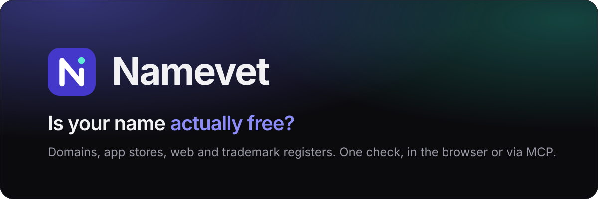
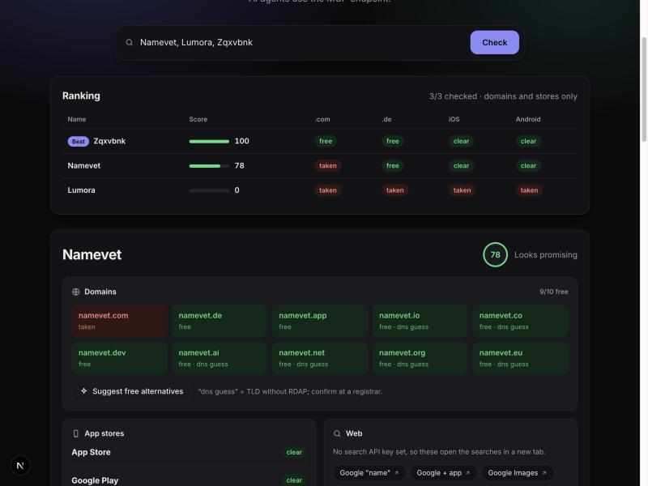

<div align="center">



<br>

[](https://nextjs.org)
[](https://www.typescriptlang.org)
[](https://modelcontextprotocol.io)
[](LICENSE)
[](#configuration)

**Vet a product name in seconds.** Domains, App Store, Google Play, web and trademark registers in one check.
Use it in the browser, or hand a shortlist to your AI agent over MCP.

[Quick start](#quick-start) · [Use with AI agents](#use-with-ai-agents) · [What it checks](#what-it-checks) · [Deploy](#deploy)

</div>

<br>

<p align="center">
  
</p>

## Why

Picking a name means opening a registrar, two app stores, Google and two trademark registers, for every candidate. Namevet does the first screen for you: paste a list, get a ranking, and only open the registers for the names that survive.

## Features

- **Domains.** 10 TLDs per name via RDAP (authoritative), with a DNS fallback for TLDs without RDAP.
- **Free alternatives.** Tries other TLDs, prefixes (`get`, `try`, `use`) and suffixes (`app`, `hq`, `labs`) and returns what is free.
- **App Store and Google Play.** Exact, similar or no match, with the competing listings.
- **Web.** Exact-phrase search: inline results with a Google or Brave key, deep links without.
- **Trademark registers.** DPMA, EUIPO, TMview and WIPO links with Nice classes 9, 35 and 42.
- **Ranking.** A 0-100 score per name, so a list of 25 becomes an ordered shortlist.
- **GitHub.** Optional handle and repo-name check for developer tools, via MCP.
- **Creative naming skill.** A Claude Code skill that invents non-generic names and vets them with Namevet.
- **MCP server.** Eight tools, including `check_names` for whole lists. Works with Claude, Codex, Gemini CLI, Cursor, VS Code and anything that speaks MCP.
- **No database, no required keys.** One Next.js app, deploys to Vercel in a minute.

## Quick start

```bash
npm install
npm run dev
```

Open <http://localhost:3000>, paste one or more names (comma or line separated), press Enter.

## What it checks

| Check | Source | Confidence |
|---|---|---|
| Domains | RDAP (.com, .de, .app, .dev, .ai, ...). TLDs without RDAP (.io, .co, ...) use a DNS lookup, marked `dns guess` | RDAP: high. DNS: heuristic |
| Suggestions | Variants of the name, each checked like a normal domain | same as above |
| App Store | iTunes Search API | good |
| Google Play | [`google-play-scraper`](https://github.com/facundoolano/google-play-scraper) (unofficial, can break when Google changes markup) | good, fragile |
| Web | Google Programmable Search or Brave Search if a key is set, otherwise links | links only without a key |
| Registers | Deep links to DPMAregister, EUIPO eSearch, TMview, WIPO Brand DB | manual review |

> [!IMPORTANT]
> DPMA, EUIPO and TMview have no free public search API, so those are deliberate link-outs. A free domain and "no store match" are **not** trademark clearance. Review the registers for every name you shortlist.

### Score

`score = domains (50) + stores (50)`. `.com` is worth 22, `.de` 18, the other TLDs up to 10; each store gives 25 for no match, 12 for similar names, 0 for an exact match. It is a screening heuristic, not legal advice.

## Use with AI agents

The MCP endpoint is `/mcp` (Streamable HTTP). Replace `<URL>` with `http://localhost:3000/mcp` or your deployed `https://.../mcp`. The home page shows the same snippets with copy buttons and your own URL filled in.

| Agent | Setup |
|---|---|
| **Claude Code** | `claude mcp add --transport http namevet <URL>` (add `--scope user` for all projects), or `.mcp.json`: `{"mcpServers":{"namevet":{"type":"http","url":"<URL>"}}}` |
| **Claude Desktop** | `claude_desktop_config.json`: `{"mcpServers":{"namevet":{"command":"npx","args":["-y","mcp-remote","<URL>"]}}}`, then restart. With a public https URL: Settings > Connectors > Add custom connector |
| **claude.ai** | Public https URL required. Settings > Connectors > Add custom connector. No static bearer token support, so leave `MCP_AUTH_TOKEN` unset |
| **Codex** | `codex mcp add namevet --url <URL>`, or `~/.codex/config.toml`: `[mcp_servers.namevet]` with `url = "<URL>"` |
| **Gemini CLI** | `gemini mcp add --transport http namevet <URL>` |
| **Cursor** | `.cursor/mcp.json`: `{"mcpServers":{"namevet":{"url":"<URL>"}}}` |
| **VS Code (Copilot)** | `.vscode/mcp.json`: `{"servers":{"namevet":{"type":"http","url":"<URL>"}}}` |
| **Anything else** | Any client with Streamable HTTP. stdio-only clients: `npx -y mcp-remote <URL>` |

Auth is optional. Set `MCP_AUTH_TOKEN` and the server requires `Authorization: Bearer <token>`. Add it with `--header "Authorization: Bearer <token>"` (Claude Code, Gemini CLI) or `--bearer-token-env-var` (Codex).

Then just ask:

> Use namevet to check these names and rank them: Assay, Plumb, Tidepool. Then show trademark links for the best two.

### Skill: creative naming

`.claude/skills/creative-naming/SKILL.md` teaches an agent to invent names that do not read like generated slop (no `-ly`, `-ify`, Nova or Lumora-style mashups), then vet them through Namevet before recommending anything. It is picked up automatically in this project. To use it everywhere, copy it:

```bash
mkdir -p ~/.claude/skills && cp -r .claude/skills/creative-naming ~/.claude/skills/
```

Then ask: *"Invent names for a privacy-first note app. Use creative-naming."*

### Tools

| Tool | What it does |
|---|---|
| `check_names` | **Batch.** Up to 25 names in, ranked result out: score, free and taken domains, store verdicts, notes. `details: true` for full data |
| `check_name` | Full check of one name |
| `check_domains` | Availability per TLD |
| `suggest_domains` | Free alternative domains |
| `check_app_stores` | App Store and Google Play |
| `check_github` | GitHub user/org handle and repo name collisions (set `GITHUB_TOKEN` for batches) |
| `check_web` | Exact-phrase web search |
| `trademark_links` | DPMA, EUIPO, TMview, WIPO links with Nice classes |

## HTTP API

```bash
curl "http://localhost:3000/api/check?name=Namevet&tlds=com,de,app"
curl "http://localhost:3000/api/suggest?name=Namevet"
```

## Configuration

Everything is optional. Copy `.env.example` to `.env.local`.

| Variable | Effect |
|---|---|
| `GOOGLE_CSE_KEY`, `GOOGLE_CSE_CX` | Inline Google results and result count in the Web section |
| `BRAVE_API_KEY` | Inline Brave results instead (used if no Google keys) |
| `GITHUB_TOKEN` | Raises GitHub API limits for `check_github` (unauthenticated: 10 searches per minute) |
| `MCP_AUTH_TOKEN` | Require a bearer token on `/mcp` |
| `NEXT_PUBLIC_CONTACT_EMAIL` | Shown on `/impressum` |

## Deploy

```bash
npx vercel
```

or import the repository in Vercel. It needs no build settings. The web page and `/api/*` have no authentication, so add rate limiting or protect the deployment if you make it public.

## Project layout

```
app/            pages, /api routes and the /mcp server
components/     UI (checker, ranking, cards, agent setup guide)
lib/            checks: domains, stores, web, trademarks, scoring, batch
docs/           banner and screenshot
```

## Roadmap

- EUIPO trademark API integration (needs registered credentials)
- Social handle checks (X, Instagram) and npm / PyPI package names
- Retry and caching for registry lookups
- Shareable result links

## Impressum

The `/impressum` page holds the provider details required in Germany (§ 5 DDG). Set your own details in `app/impressum/page.tsx` if you fork this.

## License

[MIT](LICENSE) © Mika Stiebitz
